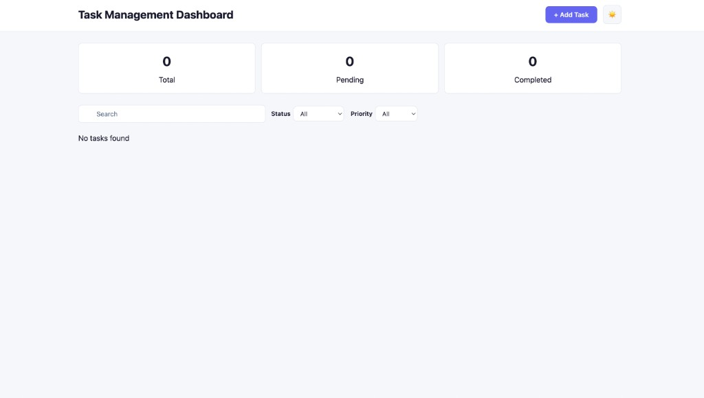
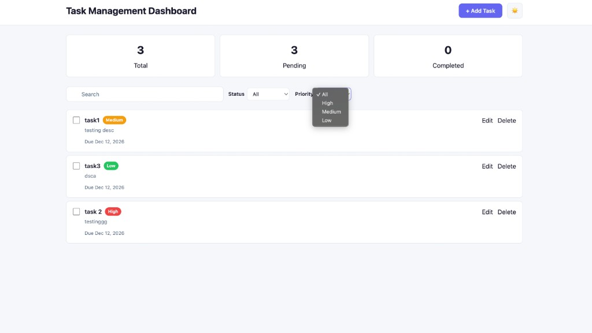
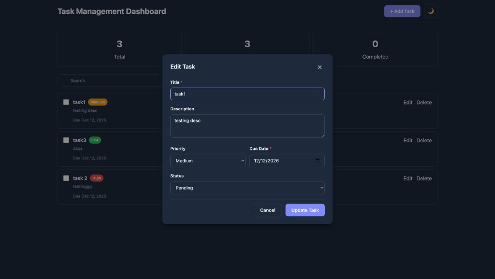
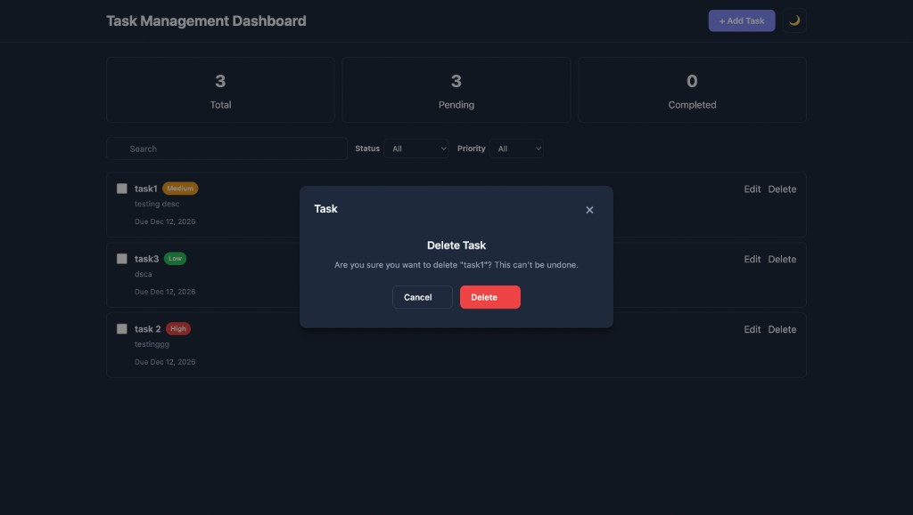
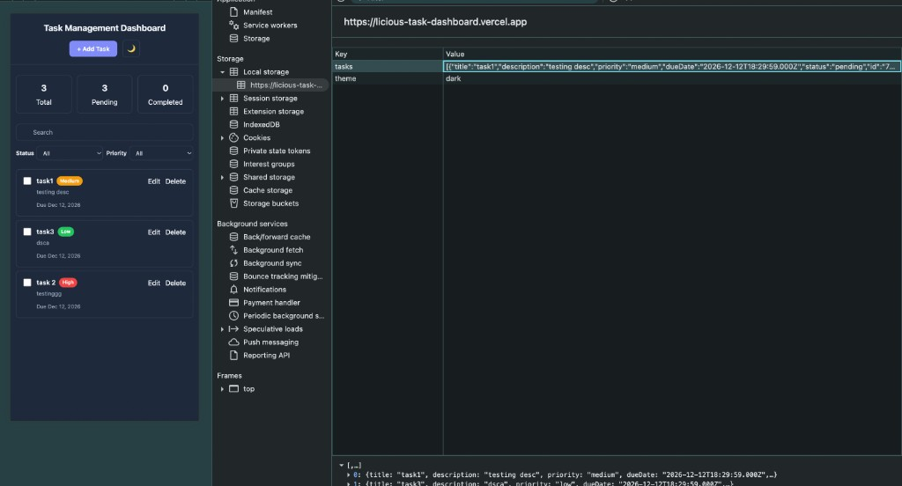

# Licious — Task Management Dashboard

**Live Demo:** [https://licious-task-dashboard.vercel.app](https://licious-task-dashboard.vercel.app)

## Screenshots

### Light Mode — Empty State


### Light Mode — Priority Filter


### Dark Mode — Edit Task


### Dark Mode — Delete Confirmation


### Dark Mode — LocalStorage Persistence


## Getting Started

```bash
npm install
npm run dev
```
